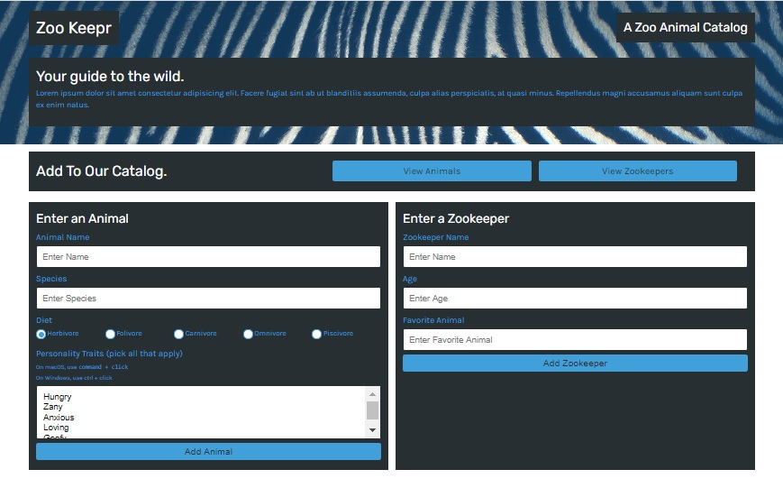
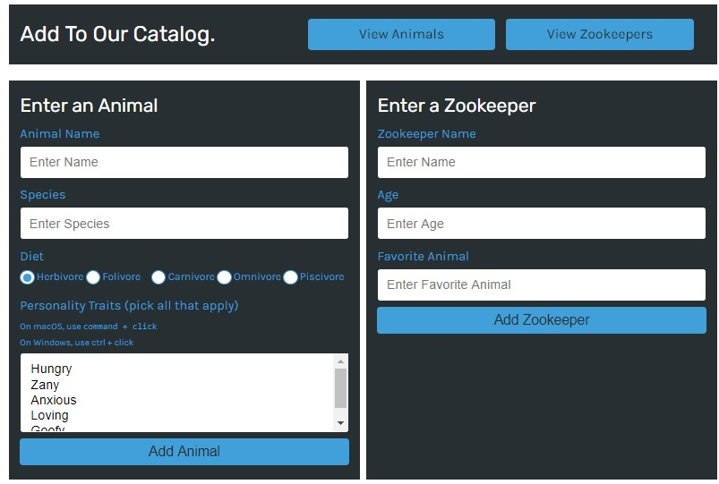
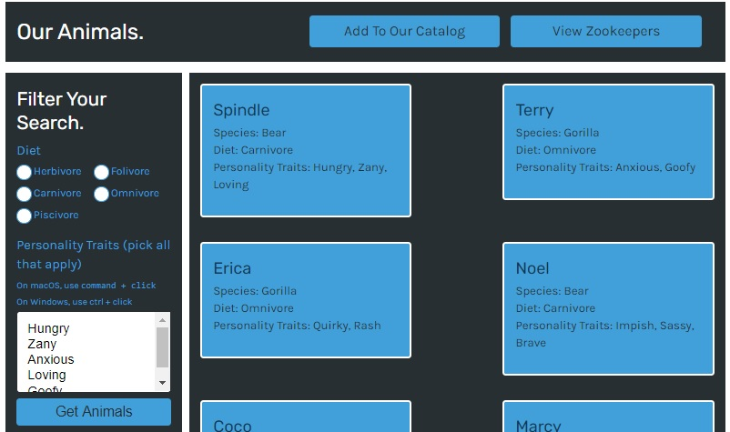
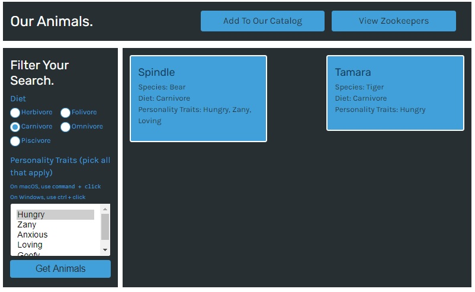

# ZOO KEEPR

  

# Description

Zoo keepr is an application that shows an online catalog about a zoo,where the user can access this information from any device and interact.

   
 _____________________________________________________________________
 Visit the site! [Zoo Keepr](https://zookeepr1.herokuapp.com/)

# Table of Contents

[Installation](#Installation)

[Usage](#Usage)

[License](#License)

[Technologies](#Technologies)

[Questions](#Questions)

  
# Installation 
 - Clone the app in to your pc.
- Open a console terminal for the app from the file server.js.
- Run the line command `npm install` and then `npm start`.
- Open the browser and type in the address bar `http: // localhost: 3001 /`

# Usage 
 -  The user has several options to choose from to interact with the application, such as:
> - Add Animals.
> - Add Zookeeper.
> - View Animals.
> - View zookeepers.

The user can add an animal or a zookeeper from the same page, as shown in the following image:

 

The user can see all the animals in the zoo catalog by clicking on the `View Animals` button and then if he wishes he can filter the search by ` Diet` and `Personality Traits `.

 

 > - Example of a search performed by the user.

  

# License
The license for which the application is covered:
NONE 

# Technologies 
 - NODE
 - EXPRESS
 - JAVASCRIPT
 - JEST

# Questions

  If you have questions about the project, below you can find ways to answer them, either by visiting my highub or contacting me by email
  
  Link to my Github: [anniavd](https://github.com/anniavd)

  
  Email acount: [annia.valdesd@gmail.com](mailto:annia.valdesd@gmail.com)
    
